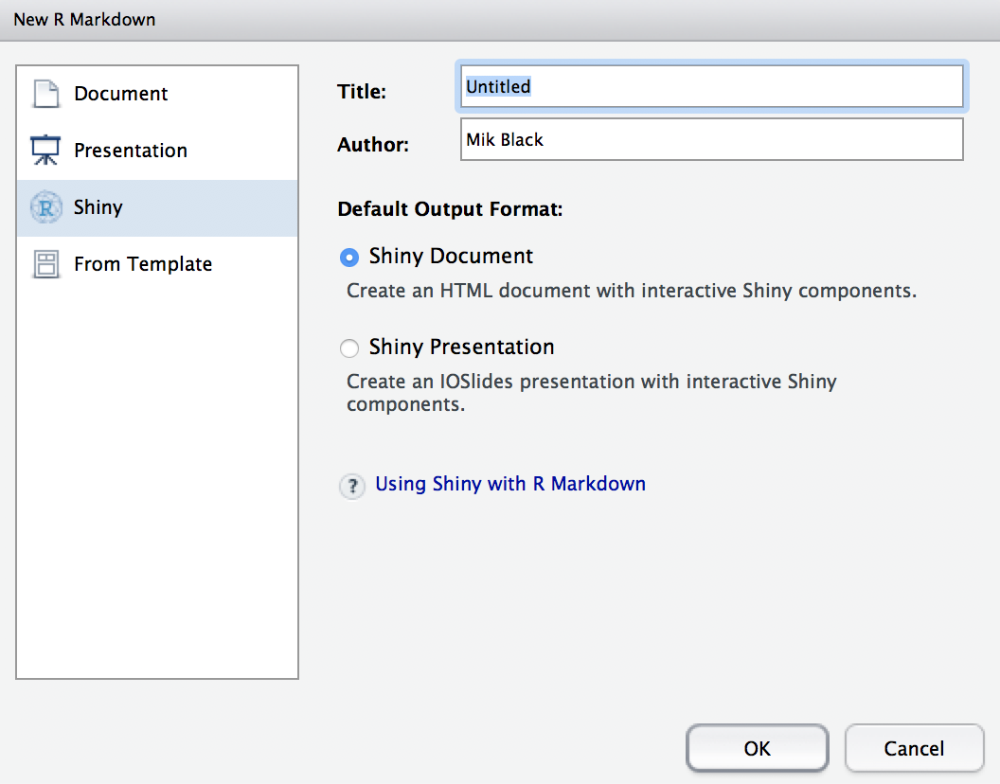
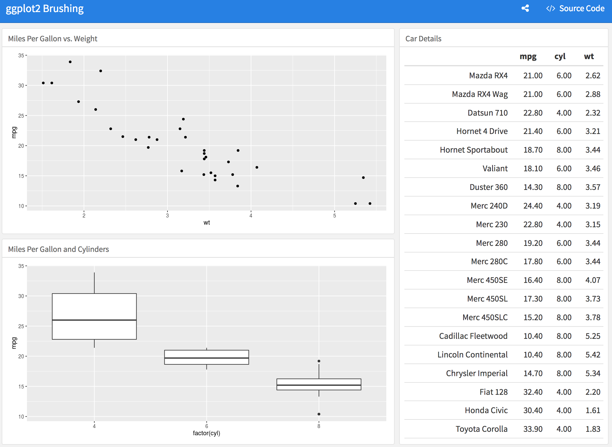
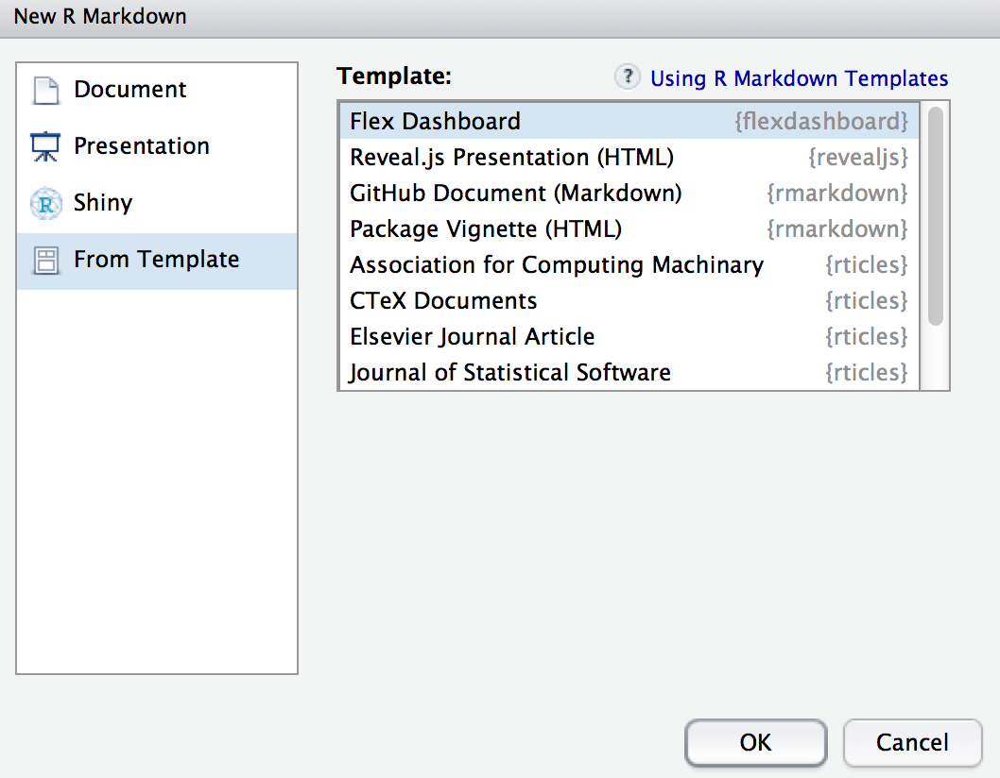
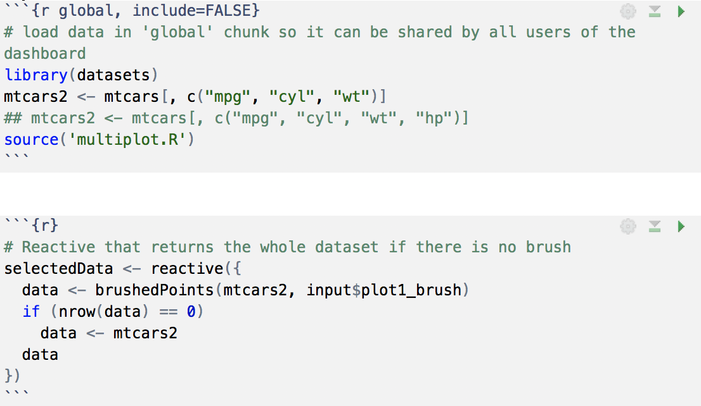
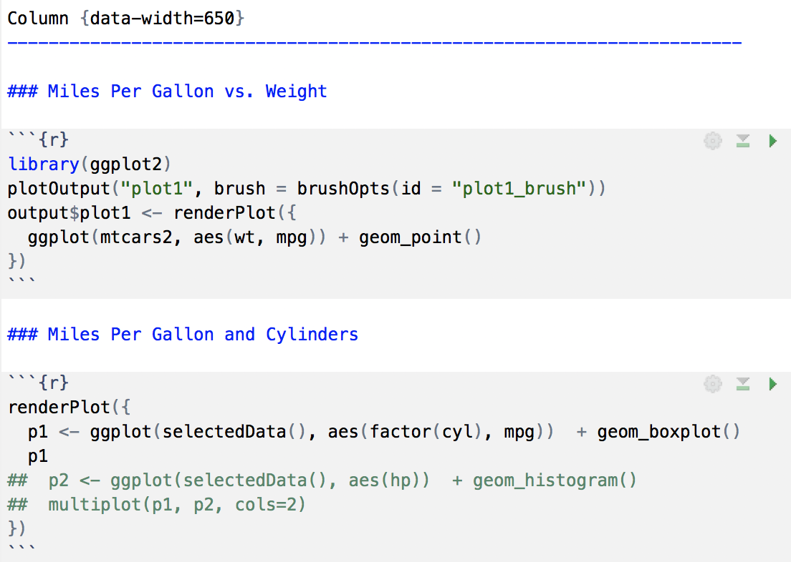
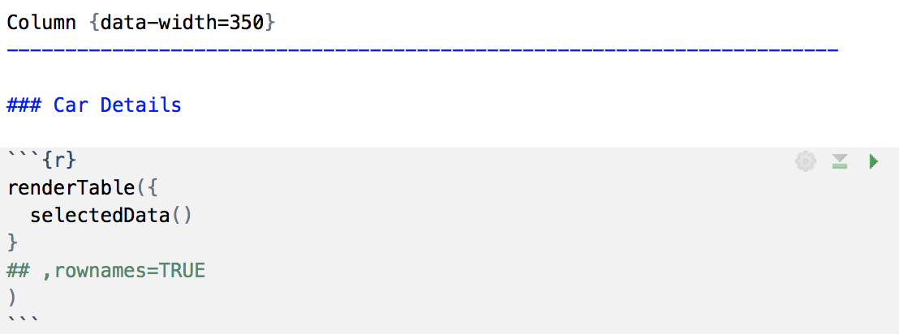
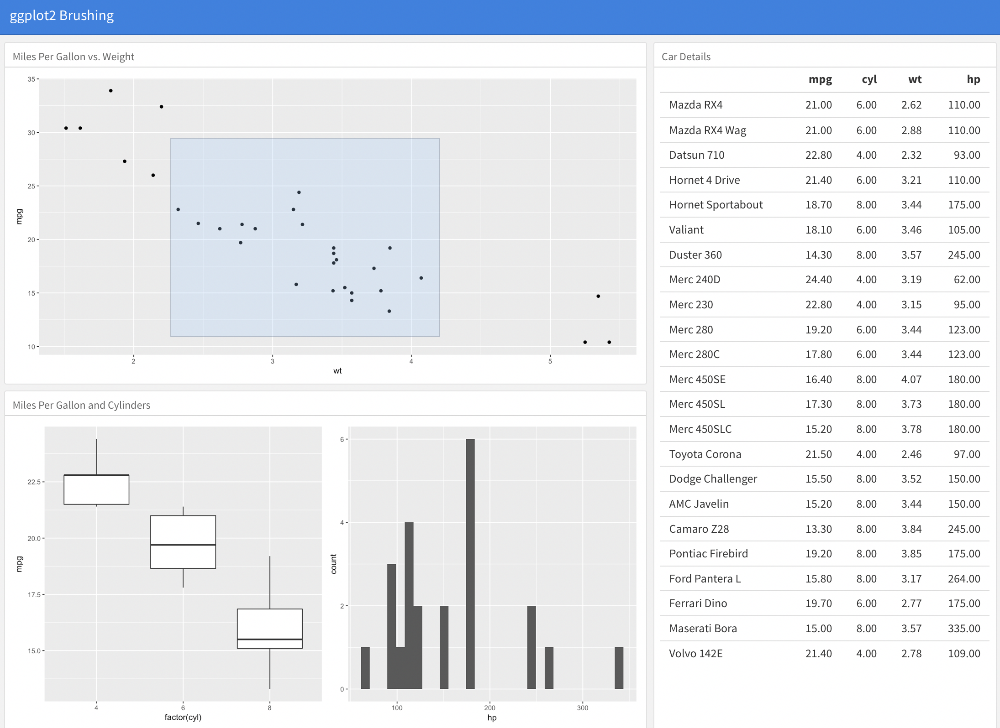

```{r setup, include=FALSE}
knitr::opts_chunk$set(echo = FALSE)
```

## Shiny apps inside R Markdown

 - This is stupidly easy to do.
 - There is a ton of information on the RStudio website:
    http://rmarkdown.rstudio.com/authoring_shiny.html
 - Basically all you have to do is choose to select "Shiny Document" or "Shiny Presentation" when you are creating an Rmarkdown file.
 - Then you just add your Shiny content as R chunks in the Rmd file.

## It's easy
 
<center></center>

## Interactive Plot

```{r eruptions}
inputPanel(
  selectInput("n_breaks", label = "Number of bins:",
              choices = c(10, 20, 35, 50), selected = 20),
  
  sliderInput("bw_adjust", label = "Bandwidth adjustment:",
              min = 0.2, max = 2, value = 1, step = 0.2)
)

renderPlot({
  hist(faithful$eruptions, probability = TRUE, breaks = as.numeric(input$n_breaks),
       xlab = "Duration (minutes)", main = "Geyser eruption duration")
  
  dens <- density(faithful$eruptions, adjust = input$bw_adjust)
  lines(dens, col = "blue")
})
```

## Interactive Plot: the code

```{r, echo=TRUE, eval=FALSE}
inputPanel(
  selectInput("n_breaks", label = "Number of bins:",
              choices = c(10, 20, 35, 50), selected = 20),
  
  sliderInput("bw_adjust", label = "Bandwidth adjustment:",
              min = 0.2, max = 2, value = 1, step = 0.2)
)

renderPlot({
  hist(faithful$eruptions, probability = TRUE, breaks = as.numeric(input$n_breaks),
       xlab = "Duration (minutes)", main = "Geyser eruption duration")
  
  dens <- density(faithful$eruptions, adjust = input$bw_adjust)
  lines(dens, col = "blue")
})
```

## 

<BR><BR><BR><BR><BR><BR>
<center><h2>ARE WE DONE NOW?</h2></center>

## What about something cooler?

<center></center>

<BR>
https://jjallaire.shinyapps.io/shiny-ggplot2-brushing/

## Dashboards - they're cool

`flexdashboard`: Use R Markdown to publish a group of related data visualizations as a dashboard.
 
```{r, eval=FALSE, echo=TRUE}
install.packages("flexdashboard")
```

<center></center>

<BR>
http://rmarkdown.rstudio.com/flexdashboard/

## Setup
<center></center>

## First column (two plots)
<center></center>

## Second column (table: brushed data)
<center></center>

## Some extra tweaks
<center></center>


